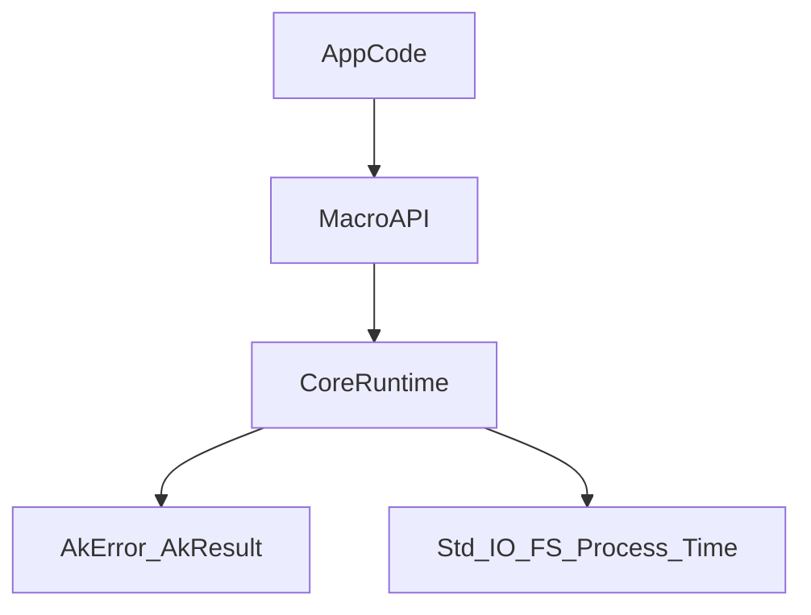

# Architecture

## Design goals

- Stable macro API surface for long-term projects.
- Small public surface with explicit naming contracts.
- Centralized execution logic for cross-platform behavior and validation.
- Strong quality gates for CI-first development teams.

## Layers

- `src/macros/*`: Public DSL/macros only.
- `src/core.rs`: Internal runtime helpers used by macros.
- `src/error.rs`: Unified crate error model and result aliases.
- `tests/*`: Integration-level macro behavior validation.

## Flow

## Public API policy

- Major API changes are allowed only in major releases.
- Fallible actions return `AkResult<T>`.
- Macro names are short, verb/resource-first, and composable.

## Enterprise usage guidance

- Keep macro usage close to orchestration boundaries (CLI jobs, build pipelines, utility services).
- For domain/business logic, call regular Rust functions and use AK macros for ergonomics at boundaries.
- Use CI gates (`fmt`, `clippy`, `test`) as mandatory merge checks.
